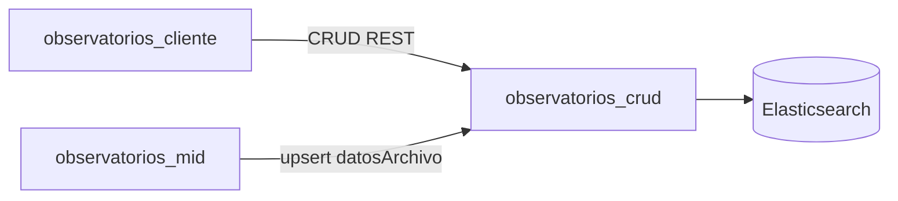

# Arquitectura e integraciones — observatorios_crud

## Arquitectura del repositorio
- Stack: Django + DRF + Elasticsearch.
- Patrón principal: API REST por apps de dominio con capa común para operación en índices.

## Diagrama de contexto

## Interacciones esperadas
| Sistema origen | Interacción | Resultado |
|---|---|---|
| `observatorios_cliente` | Consumo de endpoints `api/v1` | Operación funcional del módulo observatorios |
| `observatorios_mid` | Escritura/actualización de datos de archivo | Sincronización de metadatos documentales |

## Riesgos técnicos
- Configuración sensible de seguridad y entorno debe endurecerse por ambiente.
- Acoplamiento alto a disponibilidad de Elasticsearch.
- Contratos entre versiones de API y consumidores deben formalizarse.

## Pendientes SDD
- Inventario de endpoints críticos y criterios de aceptación por recurso.
- Matriz de compatibilidad de contratos para cliente y MID.
